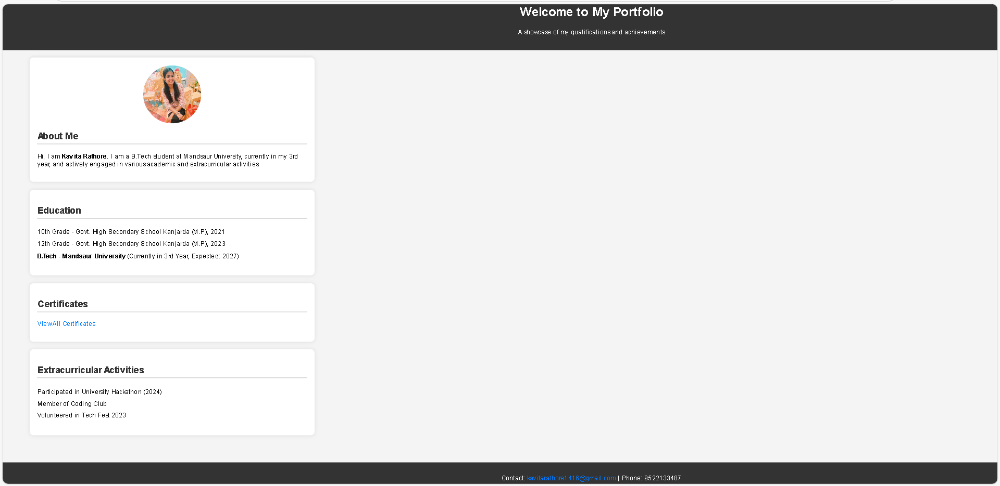

🌐 My Portfolio Website

Welcome to my personal portfolio website — built to showcase my skills, projects, and achievements as a budding web developer.

✨ Features

 •Clean and modern design  
 •Responsive layout for all devices  
 •Interactive sections like About, Skills, Projects, Certificates, and Contact  
 •Smooth scroll and animations (if applied)  

🔧 Tech Stack Used

 • HTML5  
 •CSS3  
 •JavaScript  
 • Bootstrap (optional, if used)  

🖼️ Screenshot

📂 Project Structure

MyPortFoliooo/
│
├── index.html
├── certificates.html
├── style.css
├── script.js
├── README.md
└── images/
└── homepage.png

🚀 Live Demo

 🔗 [Click to view the live site](#) — _(You can replace this with GitHub Pages link later)_

🙋‍♀️ Made with ❤️ by Kavita Rathore

   Feel free to connect with me or suggest improvements!

  📩 Email: kavita98rathore@gmail.com  
  🌐 GitHub: [@kavita98rathore](https://github.com/kavita98rathore)

